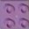
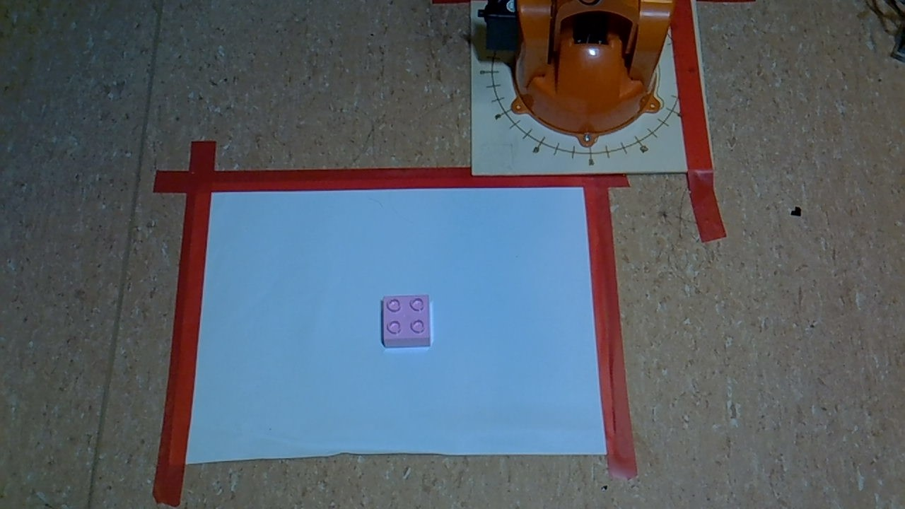
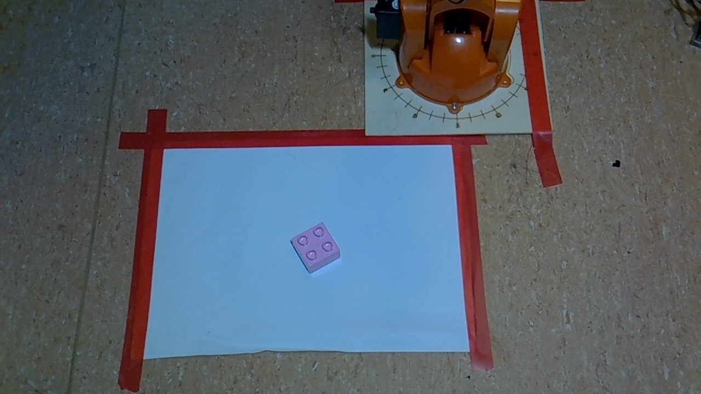
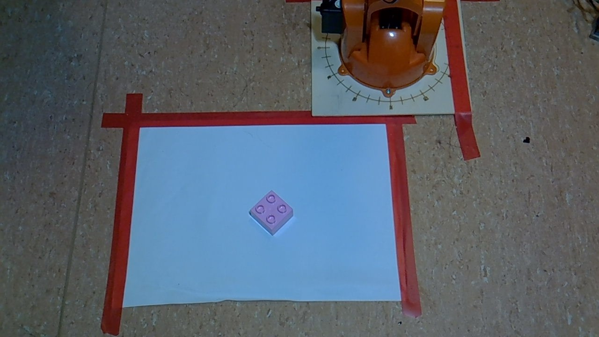
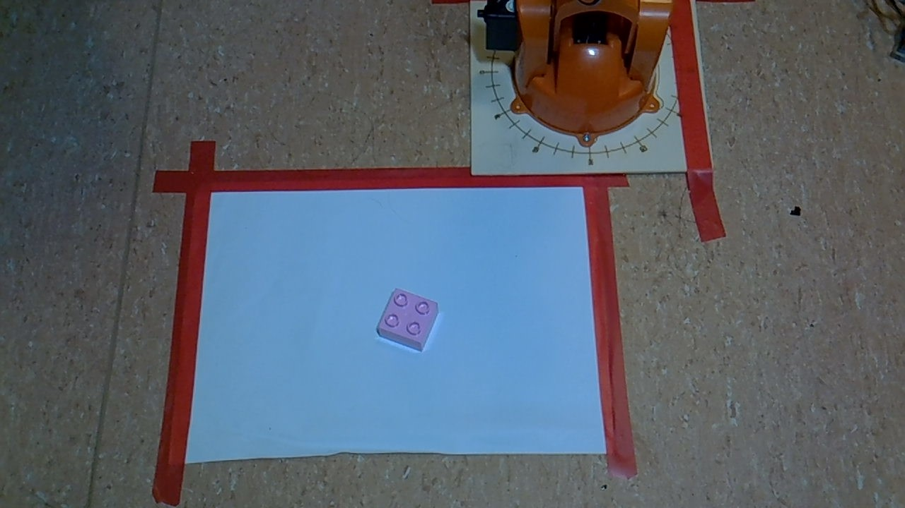
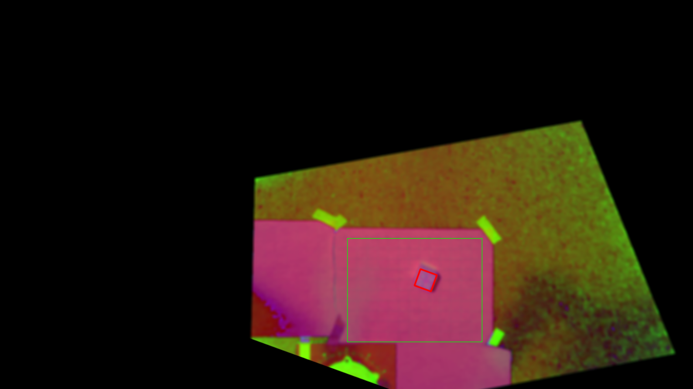
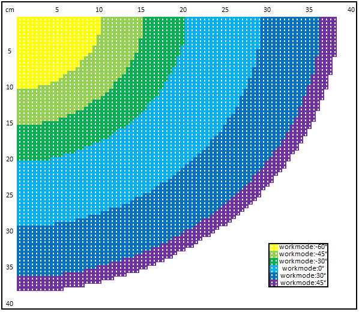
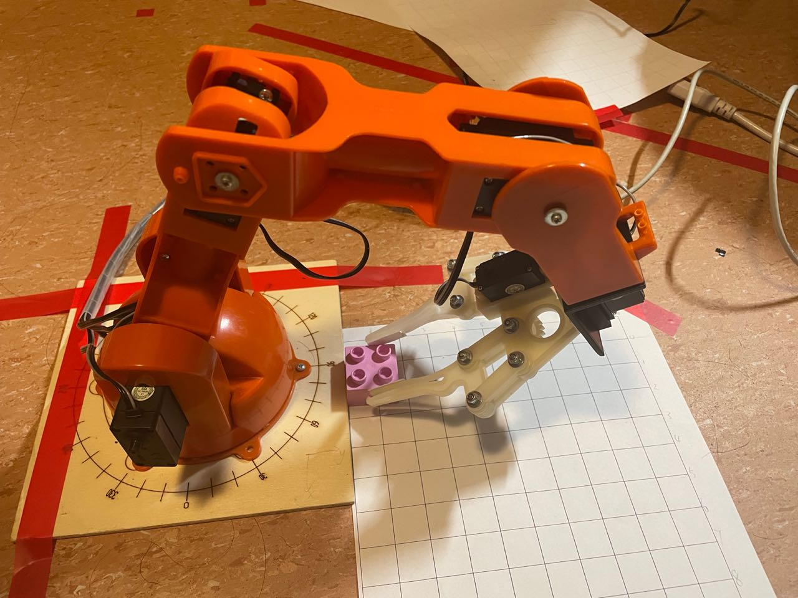
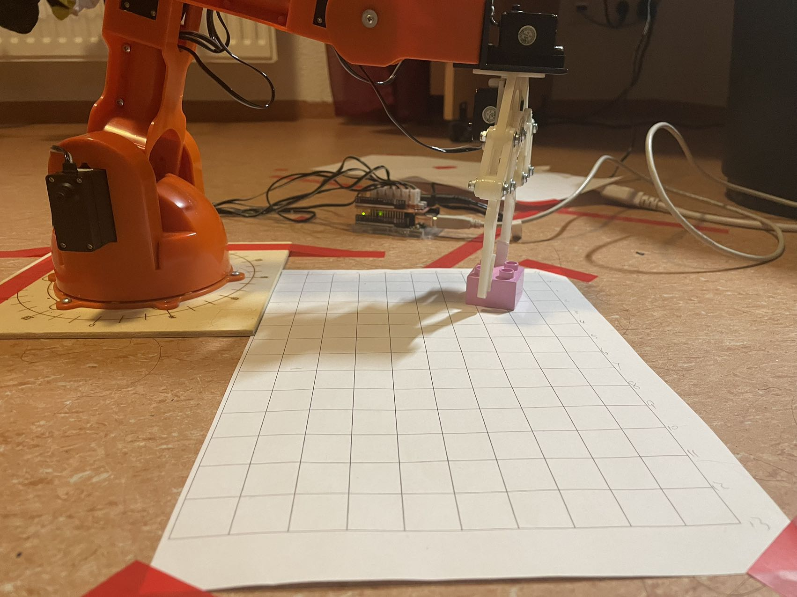
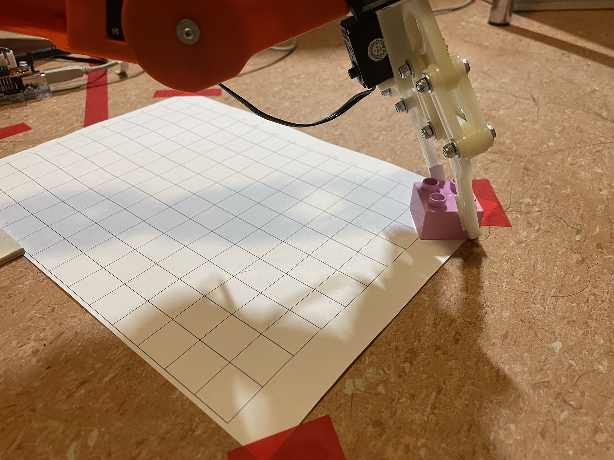

# Project Design

The robotic arm grasping the object block mainly realizes two main functions, the image recognition function of the camera and the planning path function.

     

## Image Recognition

The position of the target is determined by comparing the template and the actual captured image.

     

Target blocks at different angles

     
    

        
0°

    

     
    

        
30°

    

     
    

        
45°

    

     
    

        
60°

    

Image recognition of camera viewpoints

     
    

        

    

The red square box indicates the position of the target block after comparing the viewing angle with the template, which is the position that will be grasped.

## Path Planning

The robotic arm has three working modes for grasping targets in different areas.

     
    

        
working mode for different area

    

     
    

        
working area 1

    

     
    

        
working area 2

    

     
    

        
working area 3

    

     
    

        
Success rate in different areas

    

## Coursework Report

More details please take a look at：<a href="https://github.com/Jcheems/Jcheems.github.io/blob/main/doc/Robotic%20Arm%20Project/Project_Report.pdf" target="_blank">Coursework Project.</a>
